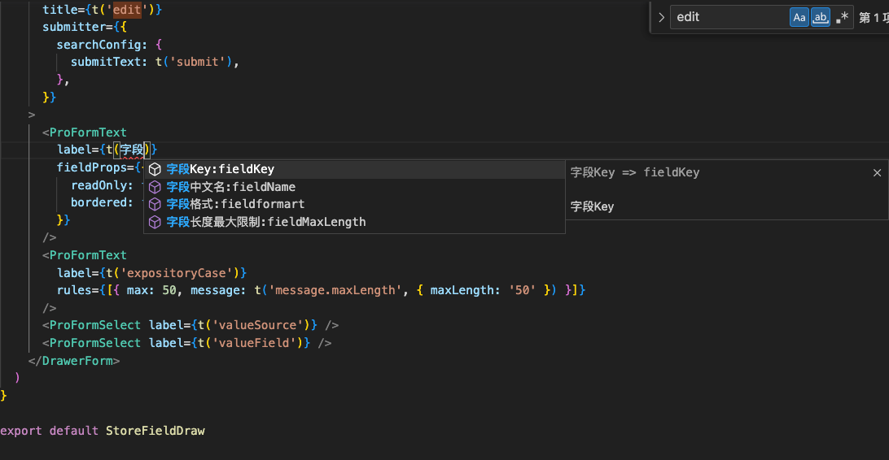
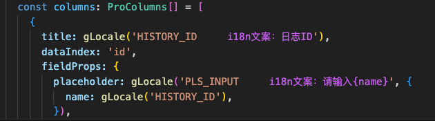

# wa-language-tip 多语言提示

## 功能说明

例

```typescript
// src/locales/zh-CN.ts (非固定 waLanguageTipSettingPath 可配置地址)
export default {
  message: "hellow",
};
```

在输入代码时 输入 message 满足 startWith 会提示他的 i18n key 回车直接生成

在编辑器中直接显示字符对应的 i18n 默认语言的配置


## 配置说明

1. waLanguageTipSettingPath
   文件放置位置
   默认值 src/locales/zh-CN.ts
   取值规则
   ```typescript
   // 取值优先级 package.json { config: { wa-language-tip: { waLanguageTipSettingPath: '' } } } > 设置->插件
   ```
2. 插件全局设置的格式

   ```typescript
   [{ key: "login", value: "login", isString: true }];
   ```
